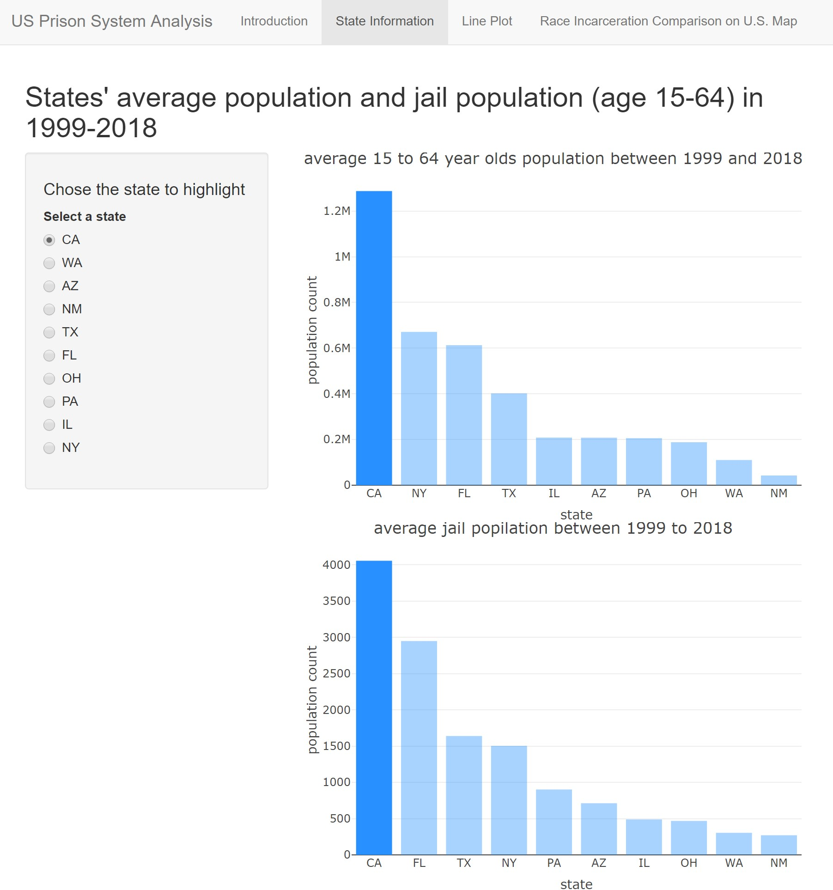
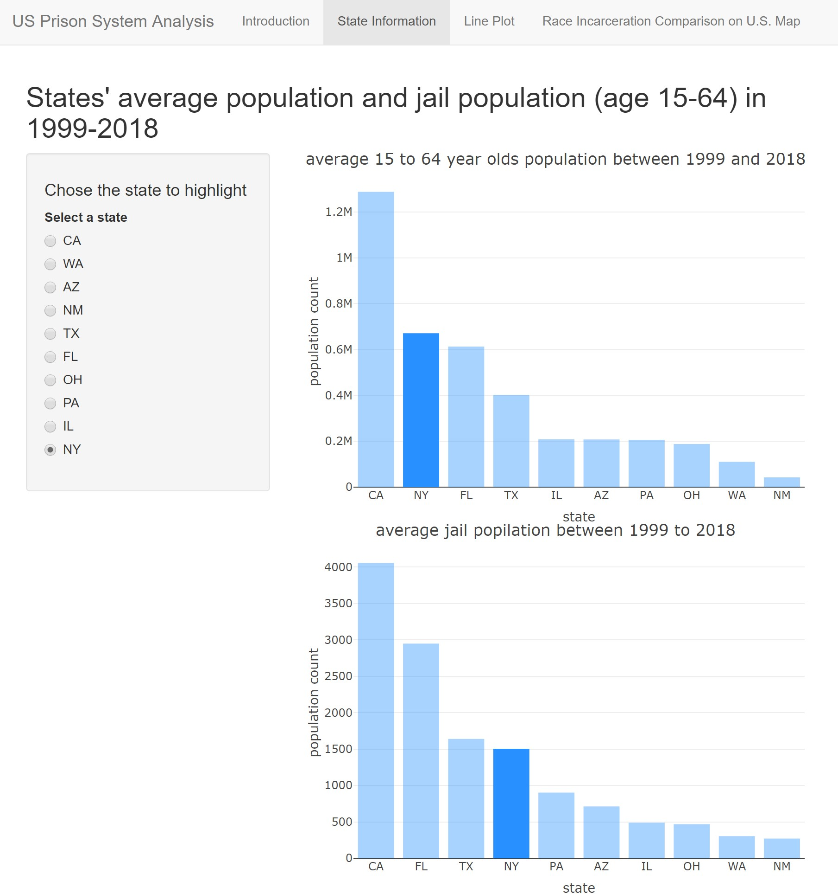
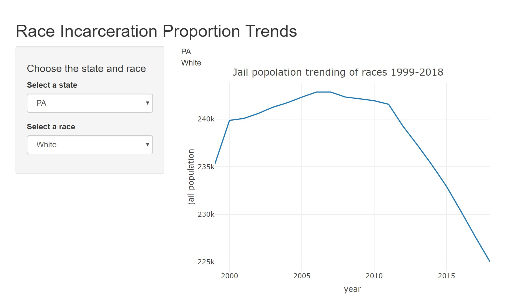
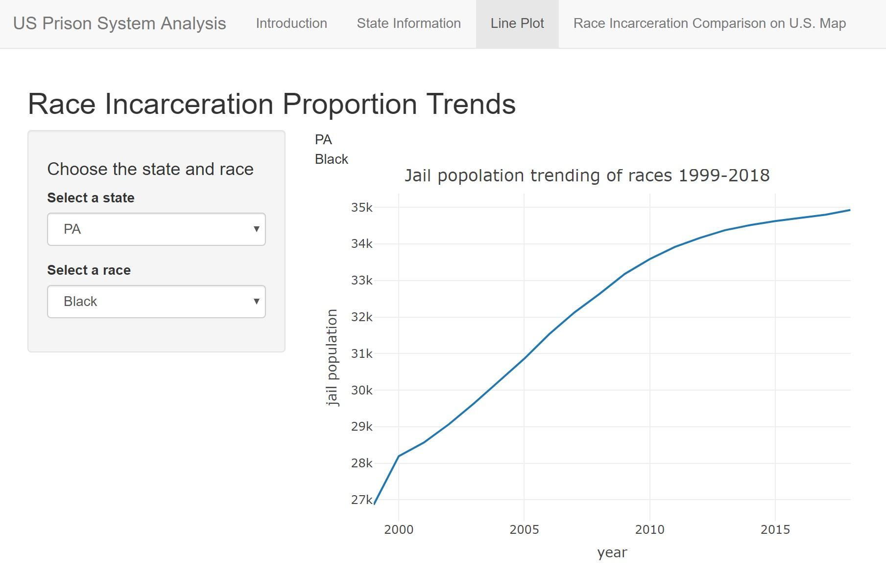
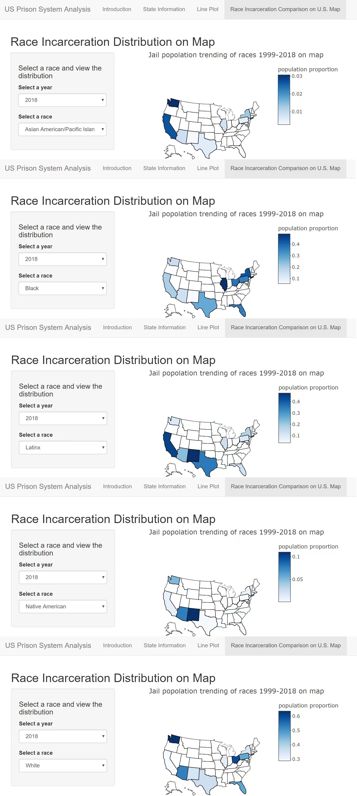

```{r setup, include=FALSE}
knitr::opts_chunk$set(echo = TRUE)
```

## Introduction

**Racism** in the United States has always been a hot topic of discussion. For this assignment, I focused on the **populations of races** and the **trends of racial incarceration population** of **ten** states of U.S. in between 1999 to 2018, to figure out **how incarceration on races changed in U.S. during 1999 to 2018**.

## Data summary

The original database I use is from [this github repository](https://github.com/vera-institute/incarceration-trends) 's file named ["incarceration_trends.csv"](csvfiles/incarceration_trends.csv). From it I chose data that are in 1999-2018 and at the state of:

 - California, 
 
 - Washington, 

 - Arizona, 
 
 - New Mexico, 
 
 - Texas, 
 
 - Florida, 
 
 - Ohio, 
 
 - Pennsylvania, 
 
 - Illinois,
 
 - New York. 
 
The reason why I chose these states is because they are they represents the most popular states in West, South, East, and North in U.S.. 

***I chose to use county's average population instead of a whole state. What ever values after the state's id represents the average value of a single county of that state.***

Because the original data was big and messy, I extracted useful data in the original database and made three tables called ["newdf.csv"](csvfiles/newdf.csv), ["statedf.csv"](csvfiles/statedf.csv), and ["df.csv"](csvfiles/df.csv). 

- The "newdf.csv" contains data that does not contains "NA"; 

- The "statedf.csv" contains rows of ten states I chosen and columns of years(1999-2018), total population, total jail population, populations for each races, and jail populations for each races (age 15-64); 

- The "df.csv" contains mean total population of all year and mean jail population of all year in ten states. 

By calculating, there are several important new values that I mainly used in my charts:

state | mean.population.allyear.15-64 | jail.population.allyear
------------- | ------------- | -------------
CA  | 1287233 | 4056
WA  | 110144 | 	305
AZ  | 207954 | 	712
NM  | 42217 | 	270
TX  | 401751 | 	1640
FL  | 612956 | 	2949
OH  | 188066 | 	468
PA  | 205595 | 	902
IL  | 208510 | 	489
NY  | 671123 | 	1504

*(table1)*

Also, jail population and proportion of races of states at a year:

(Here is the example of California and the race aapi (Asian American/Pacific Islander).)

state | year | total.population | total.jail.population | aapi.population | aapi.jail.population | aapi.jail.proportion
------------- | ------------- | ------------- | ------------- | ------------- | ------------- | ------------- |
CA | 1999 | 865477 | 3063 | 105403 | 110 | 0.035912504

*(table2)*

## Charts

Using **Shiny** in R, I got three different kind of charts to visualize the data: 

Bar chart:


*(bar chart example of California)*



*(bar chart example of New York)*

Line chart:


*(line chart example of white race in Pennsylvania)*


*(line chart example of black race in Pennsylvania)*

Map:


*(map combo example of Asian American/Pacific Islander race in 2018)*


The vales from the table shown above and from other data csv files solve the following questions: 

- **Q1: What is the average value of my variable across all the counties (in the current year)?**

A1: As data shown in table1, the mean population and jail population of counties of states who ages is 15-64 in 1999-2018 were calculated. As data shown in table2, mean population based on races were calculated.

- **Q2: Where is my variable the highest / lowest?**

A2: From bar charts we found that state who has the highest total population and jail population is CA, and the lowest is NM. We also found that some states has relatively high population and has lower jail population, such as New York, while some has even higher jail population than other state who has lower total population than them, such as Texas. 

- **Q3: How much has my variable change over the last N years?**

A3: 